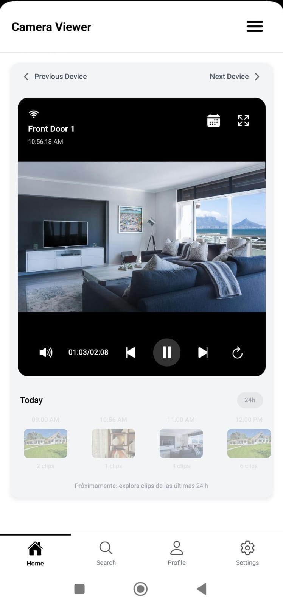
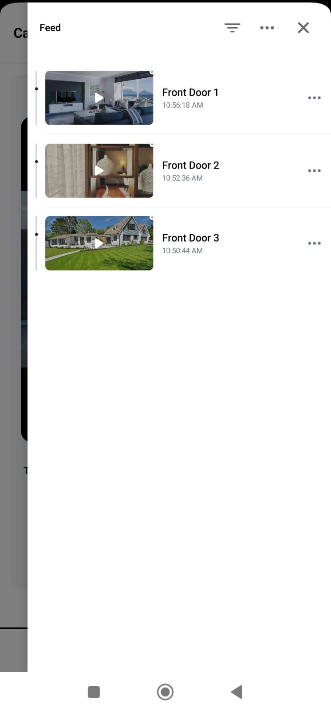
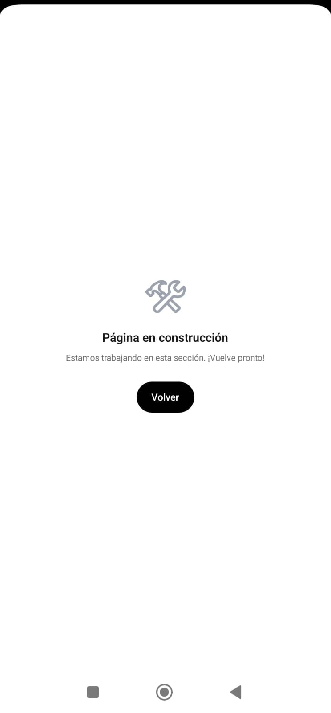
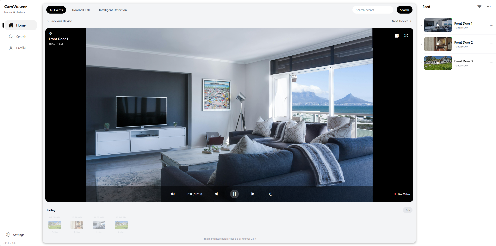
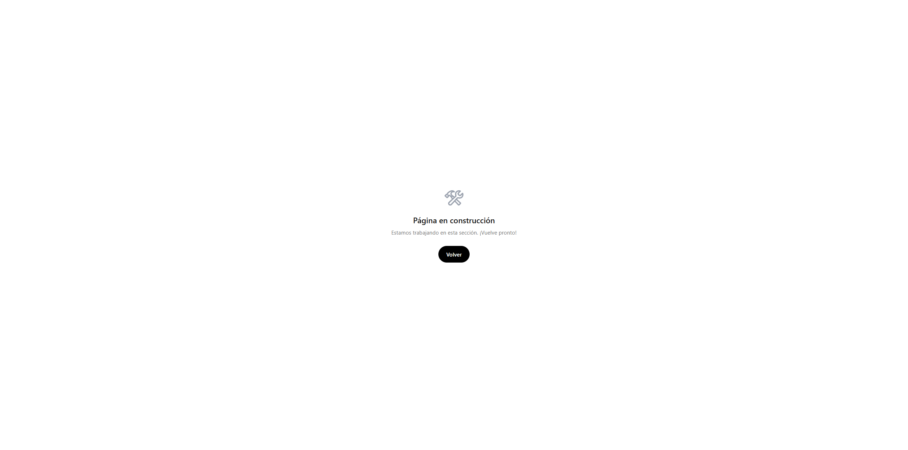

# 📹 CamViewer – Monitor & Playback App

Aplicación móvil y web para **monitoreo y reproducción de cámaras en tiempo real**, desarrollada con **React Native (Expo)** y enfocada en ofrecer una experiencia fluida, moderna y optimizada tanto en **modo móvil** como en **modo escritorio**.

Diseñada como proyecto de portafolio para demostrar habilidades en **desarrollo cross-platform**, arquitectura modular y uso de librerías modernas para UI y navegación.

---

## 🚀 Características actuales (MVP)

- **UI responsiva** adaptada para dispositivos móviles y pantallas grandes.
- **Bottom Navigation Bar** y **Sidebar** inteligente para desktop/tablet.
- **Sección Timeline** para navegación de clips recientes. Deshabilitada en el momento.
- **Pantalla de Coming Soon** para secciones en construcción.
- Navegación animada con **transiciones suaves** al cambiar de pantallas.
- Implementación de estilos con **NativeWind (TailwindCSS)** para rapidez y consistencia.
- **Feed Section** para ver todas las cameras disponibles
- **VideoPlayer Section** para ver la camera seleccionada, y expandible para pantalla completa
- **Feed Section Menu** permite filtrar, agregar y eliminar mockups de cameras actuales

---

## 🛠️ Tecnologías utilizadas

- **Frontend:** React Native (Expo)
- **Estilos:** NativeWind (TailwindCSS para React Native) + styles
- **Navegación:** Expo Router, React Navigation
- **Iconografía:** Ionicons
- **Utilidades:** React Native Safe Area Context, hooks personalizados
- **Animaciones:** Transiciones integradas en `expo-router` con `slide_from_right`

---

## 🗺️ Futuras implementaciones

Si se continúa el desarrollo, se planea añadir:

- **Autenticación segura** (JWT / OAuth2).
- **Conexión en tiempo real** con cámaras (WebRTC o RTSP).
- **Alertas push** en eventos detectados.
<!-- - **Gestión de usuarios y roles**.  -->
- **Reproducción de clips grabados** con filtros por fecha y hora.
<!-- - **Modo offline** para revisar grabaciones descargadas. -->
- **Integración con almacenamiento en la nube** (AWS S3, GCP Storage, etc.).

---

## 📸 Capturas de pantalla

### Vista móvil

<p align="center">
    &nbsp;&nbsp;&nbsp;
    &nbsp;&nbsp;&nbsp;
   
</p>

### Vista escritorio

<p align="center">
     &nbsp;&nbsp;&nbsp;
   
</p>
---

## ⚙️ Instalación y uso

```bash
# Clonar el repositorio
git clone https://github.com/EPraz/camera-ui-mvp.git

# Entrar al proyecto
cd camera-ui-mvp

# Instalar dependencias
npm install

# Ejecutar en desarrollo
npx expo start

# Ejecutar en web
npx expo start --web
```
