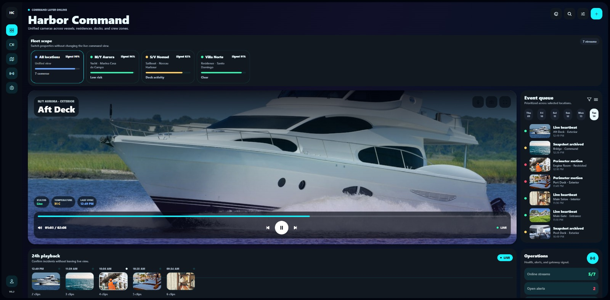
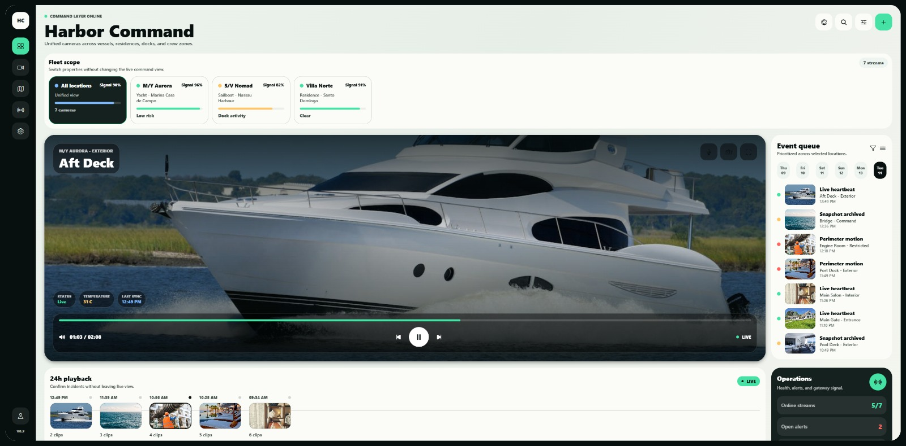
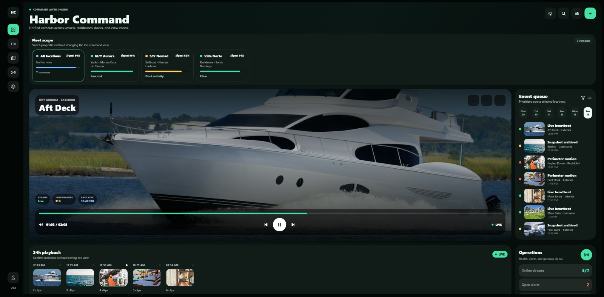

# Harbor Command

Harbor Command is a frontend MVP for a unified camera control platform. The product idea is simple: let a client monitor cameras across multiple vessels, residences, docks, and crew zones from one polished command dashboard instead of being locked into separate closed camera apps.

This repo is currently frontend-only. All camera streams, events, locations, playback clips, and system metrics are mock data built to validate the product direction and portfolio presentation before backend work begins.

## Preview

### Default Neon Theme

<p align="center">
  
</p>

### Theme Variants

| Light | Dark |
| --- | --- |
|  |  |

## What It Shows

- Multi-location camera monitoring for yachts, sailboats, residences, docks, and interior zones.
- A live command viewer with camera controls, status badges, timeline playback, and stream promotion.
- A prioritized event queue for heartbeats, archived snapshots, and motion alerts.
- A camera matrix for switching active streams quickly.
- Mobile, tablet, and desktop layouts with different navigation behavior.
- A theme system with `neon`, `dark`, and `light` token groups. `neon` is the default theme.
- A mobile/tablet command drawer, while desktop keeps the command rail visible.

## Visual Direction

The dashboard is designed as an operational security product with a premium marine/fleet feel. The default `neon` theme uses a deep black-blue base with cyan accents, subtle violet atmosphere, and alert colors reserved for actual risk states.

Themes are defined as semantic tokens in `constants/designTokens.ts`, then exposed to the camera feature through `features/camera-control/theme.ts` and `CameraThemeContext.tsx`. This keeps visual changes centralized instead of scattering hex values across components.

Theme cycle order:

```text
neon -> dark -> light -> neon
```

## Tech Stack

- Expo SDK 55
- Expo Router
- React 19
- React Native 0.83
- React Native Web
- NativeWind
- Tailwind CSS 3
- TypeScript
- Expo Linear Gradient
- Expo Vector Icons

## Project Structure

```text
app/
  (tabs)/index.tsx                  Thin route that renders the dashboard screen.

constants/
  designTokens.ts                   Light, dark, and neon theme tokens.

assets/
  images/previews/                  README screenshots for the portfolio preview.

features/
  camera-control/
    CameraControlScreen.tsx         Dashboard orchestration and responsive layout.
    CameraThemeContext.tsx          Theme provider and cycle logic.
    mockData.ts                     Demo camera/site/event data.
    navigation.ts                   Command navigation items.
    theme.ts                        Feature-facing theme helpers.
    types.ts                        Camera, site, and event types.
    components/                     Focused dashboard UI sections.
```

Legacy shared components still exist under `components/`, but the redesigned dashboard lives in `features/camera-control`.

## Getting Started

Requirements:

- Node.js 18 or newer
- npm

Install dependencies:

```bash
npm install
```

Run the web app:

```bash
npm run web
```

Run Expo normally:

```bash
npm start
```

Build the static web export:

```bash
npm run build
```

Run lint:

```bash
npm run lint
```

Run TypeScript validation:

```bash
npx tsc --noEmit
```

## Notes For Future Backend Work

The current UI assumes demo data. A production version would likely need:

- Authentication and roles.
- Camera registration by location, vessel, or property.
- Live streaming integration, likely WebRTC, RTSP gateway, or vendor API bridges.
- Event ingestion for motion, offline status, snapshots, and health checks.
- Clip playback with date/time filtering.
- Alert notification channels.
- Cloud media storage and retention policy controls.

## Development Guidelines

- Keep Expo route files thin.
- Keep camera dashboard code inside `features/camera-control`.
- Put shared design decisions in tokens instead of hardcoded component colors.
- Use Expo-compatible dependency versions rather than blindly taking latest npm releases.
- Validate meaningful frontend changes with `npm run lint`, `npx tsc --noEmit`, and `npm run build`.
